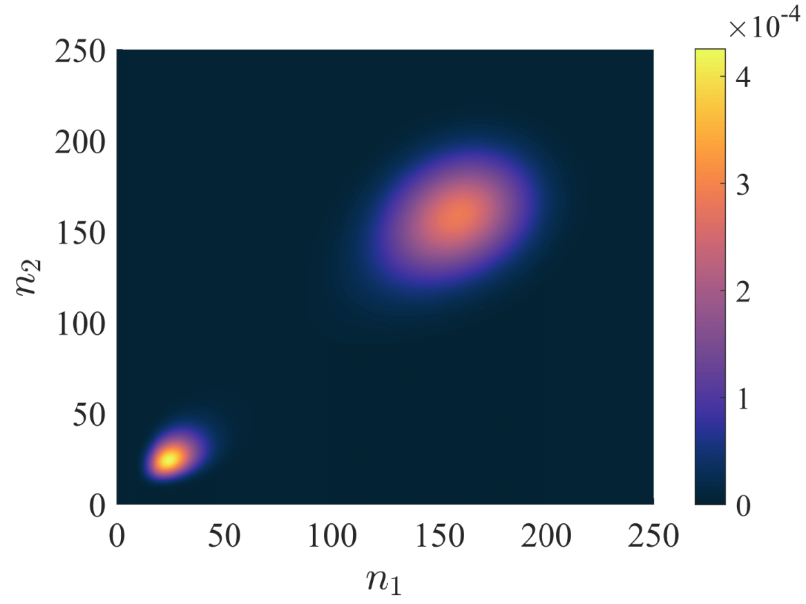

# Measuring Rare-Events using Tensor Networks

Above, the stationary joint probability distribution for the Schlogle model over two neighboring reaction voxels. Each point is the probability of observing the number of molecules in voxel one and voxel two.

# Installation
Required packages can be added using the Julia package manager. From the Julia Repl, type `]` to enter the package manager and run for example,
```julia
julia> ]

pkg> add ITensors
```

# Usage
Results from the paper can be reproduced by running files from the ``Experiments`` directory.

``Schlogl_Evolve.jl`` Will run an initially uniform distribuiton for a set amount of time, eventually reaching the stationary distribution.

The stationary distribution can be used as an input into ``Proj_EscapeProb.jl`` to calculate the rate coefficient of transitioning from basin A to basin B

``Escape_Rate_Vary_Diff.jl`` is a variant that was used to calculate the rate coefficient for various diffusion coefficients.

``Escape_Rate_VaryBD_FindErr
